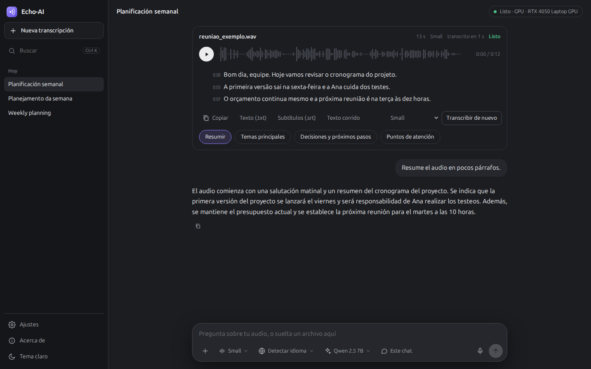

<p align="center"></p>

<h1 align="center">Echo-AI</h1>
<p align="center"><b>Echo AI Audio Transcriber</b><br>Transcripción de audio privada, con un asistente de IA local. Windows, macOS y Linux, en la tarjeta gráfica o en la CPU.</p>
<p align="center"><a href="README.md">English</a> · <a href="README.pt-BR.md">Português</a> · <b>Español</b></p>

<p align="center"></p>

Suelta cualquier archivo de audio o video, o graba con el micrófono. Echo-AI lo transcribe en tu propio equipo con
[Whisper](https://github.com/openai/whisper), muestra el texto en vivo, reproduce el audio con la parte resaltada y
responde preguntas sobre lo que se dijo con una IA local. Nada sale de tu equipo.

## Qué hace

- **Cualquier archivo con audio.** mp3, m4a, wav, ogg, opus, flac, webm, mp4, mkv, mov, notas de voz y más. El formato
  se reconoce por el contenido, no por el nombre del archivo.
- **Graba** directamente del micrófono.
- **Transcripción en vivo** con los tiempos; haz clic en una línea para escucharla. Exporta en `.txt` o subtítulos
  `.srt`.
- **Pregunta sobre el audio:** resumen, temas principales, decisiones y próximos pasos, puntos de atención, o cualquier
  pregunta. La respuesta cita la parte del audio de donde salió, y puedes buscar en todo tu historial.
- **Modelos lado a lado.** Seis modelos de Whisper y seis IAs locales, cada uno con su precisión (o calidad), velocidad,
  tamaño y la etiqueta *mejor para tu PC*. Elige uno y, si aún no está instalado, se descarga ahí mismo con una barra de
  progreso.
- **Plug and play.** Detecta el hardware y elige dónde funcionar: en una tarjeta NVIDIA cuando la hay, en la CPU cuando
  no. Nada de drivers ni Python para instalar a mano; el motor de IA se instala solo la primera vez que lo necesites.
- **Privado desde el diseño.** Los audios, las transcripciones y el historial se guardan solo en tu equipo. Internet
  solo se usa para descargar un modelo cuando lo pides. Sin cuentas, sin telemetría.
- **Interfaz en inglés, portugués y español**, con tema oscuro y claro.

## Descargar

Descarga el instalador de tu sistema en la [última versión](https://github.com/mowbrazilitteam/Echo-AI-Audio-Transcriber/releases/latest).
El modelo **Small** de Whisper viene incluido, así que la primera transcripción funciona sin internet.

| Sistema | Archivo | Primera apertura |
|---|---|---|
| Windows 10 / 11 (64 bits) | `echo-ai-*-windows.msi` | Se instala solo para tu usuario, sin contraseña de administrador. El instalador aún no tiene firma digital: en el aviso de SmartScreen, haz clic en **Más información → Ejecutar de todas formas**. |
| macOS 13+ | `echo-ai-*-mac-arm.dmg` para Apple Silicon (M1 o posterior), `echo-ai-*-mac-intel.dmg` para Intel | Arrastra Echo-AI a Aplicaciones (sin cuenta de administrador, a una carpeta `Applications` dentro de tu carpeta personal). La app aún no está notarizada: la primera vez, haz clic derecho y elige **Abrir**, o permítela en **Ajustes del Sistema → Privacidad y seguridad**. |
| Ubuntu 24.04+ y derivados | `echo-ai-*-linux.deb` | `sudo apt install ./echo-ai-*-linux.deb` (un `.deb` siempre pide `sudo`; sin él, [instala desde la terminal](#instalar-desde-la-terminal-sin-administrador)) |
| Cualquier otro Linux | — | [Instala desde la terminal](#instalar-desde-la-terminal-sin-administrador): dos comandos, sin administrador. |

**Requisitos:** 8 GB de RAM (16 GB para la IA más grande), unos 3 GB libres en disco y, si quieres, una tarjeta gráfica
NVIDIA con su driver para transcribir mucho más rápido. Todo funciona también en la CPU, solo que más lento.

## Instalar desde la terminal (sin administrador)

Para quien prefiere la línea de comandos o no puede ejecutar un instalador. Todo va a tu carpeta de usuario: sin
contraseña de administrador, sin el Python del sistema y sin git. [uv](https://docs.astral.sh/uv/) descarga Python 3.12
solo para Echo-AI.

**macOS y Linux**

```bash
curl -LsSf https://astral.sh/uv/install.sh | sh
uv tool install https://github.com/mowbrazilitteam/Echo-AI-Audio-Transcriber/archive/refs/tags/v1.0.0.zip
echo-ai
```

**Windows** (PowerShell)

```powershell
powershell -ExecutionPolicy ByPass -c "irm https://astral.sh/uv/install.ps1 | iex"
uv tool install https://github.com/mowbrazilitteam/Echo-AI-Audio-Transcriber/archive/refs/tags/v1.0.0.zip
echo-ai
```

- Si no se encuentra `uv` o `echo-ai`, abre una terminal nueva (el instalador de uv agrega `~/.local/bin` al `PATH`) o
  ejecuta `uv tool update-shell`.
- Los instaladores traen el modelo Small de Whisper incluido; aquí se descarga la primera vez. La primera vez que envíes
  un audio, Echo-AI abre la lista de modelos: elige **Small** (unos 480 MB) u otro.
- `echo-ai --navegador` abre la interfaz en tu navegador en lugar de la ventana de la app. En un Linux mínimo, sin las
  bibliotecas que usa la ventana, Echo-AI se abre solo en el navegador.
- Con git instalado, `uv tool install git+https://github.com/mowbrazilitteam/Echo-AI-Audio-Transcriber.git` instala el código más reciente de `main` en lugar de una versión publicada.

## Cómo funciona

| Parte | Qué se ejecuta | Dónde |
|---|---|---|
| Transcripción | [faster-whisper](https://github.com/SYSTRAN/faster-whisper) (Whisper en CTranslate2) | tarjeta NVIDIA en float16, o CPU en int8 |
| Respuestas de la IA | [Ollama](https://ollama.com) con modelos de 1 a 8 mil millones de parámetros | usa el Ollama que ya tengas, o instala una copia solo para Echo-AI |
| Búsqueda en la memoria | búsqueda de texto de SQLite más los vectores de `nomic-embed-text` | tu equipo |
| Interfaz | una app web local en su propia ventana (WebView2, WebKit o Qt WebEngine) | solo en `127.0.0.1` |

**Aceleración NVIDIA.** Los instaladores son ligeros, así que las bibliotecas CUDA (unos 1,4 GB) no vienen incluidas.
Cuando Echo-AI encuentra una tarjeta NVIDIA con el driver funcionando, ofrece descargar los paquetes oficiales de NVIDIA
desde PyPI, los verifica con la suma SHA-256 publicada y pasa a transcribir en la tarjeta sin reiniciar. Otras tarjetas
y los Mac transcriben en la CPU (CTranslate2 solo acelera NVIDIA).

**El motor de IA.** Si Ollama no está instalado, la primera vez que instales una IA Echo-AI descarga el paquete oficial
de Ollama para tu sistema (una versión fija, verificada con la SHA-256 publicada por Ollama), lo extrae en su carpeta de
datos y lo ejecuta en un puerto propio. No hace falta ser administrador.

### Modelos de transcripción

| Modelo | Precisión | Velocidad | Descarga | Para qué |
|---|:---:|:---:|---:|---|
| Tiny | ●○○○○ | ●●●●● | 75 MB | pruebas, equipos muy antiguos |
| Base | ●●○○○ | ●●●●● | 145 MB | voz clara en un lugar silencioso |
| **Small** (incluido) | ●●●○○ | ●●●●○ | 480 MB | el audio del día a día en cualquier equipo |
| Medium | ●●●●○ | ●●●○○ | 1,5 GB | más precisión, un poco más lento |
| Large v3 Turbo | ●●●●○ | ●●●●○ | 1,6 GB | casi la máxima precisión, rápido en la tarjeta |
| Large v3 | ●●●●● | ●●○○○ | 3,1 GB | audio difícil: ruido, acentos, muchas voces |

### Modelos de IA

| Modelo | Calidad | Velocidad | Descarga | Para qué |
|---|:---:|:---:|---:|---|
| Qwen 2.5 1.5B | ●●○○○ | ●●●●● | 1,0 GB | resúmenes cortos en equipos sencillos |
| Llama 3.2 3B | ●●●○○ | ●●●●○ | 2,0 GB | respuestas rápidas en inglés |
| Qwen 2.5 3B | ●●●○○ | ●●●●○ | 1,9 GB | 8 GB de RAM; inglés, portugués y español |
| Gemma 3 4B | ●●●●○ | ●●●○○ | 3,3 GB | portugués y español naturales |
| Qwen 2.5 7B | ●●●●● | ●●○○○ | 4,7 GB | los mejores resúmenes; 16 GB de RAM o una tarjeta de 6 GB |
| Llama 3.1 8B | ●●●●○ | ●●○○○ | 4,9 GB | una alternativa de 8 B, fuerte en inglés |

Echo-AI solo ofrece modelos de conversación de 1 a 8 mil millones de parámetros: lo bastante pequeños para un equipo
normal y buenos para hablar de una transcripción. Los modelos de mezcla de expertos, de código y de vectores quedan
fuera.

## Tus datos

Todo se guarda en una carpeta de tu equipo:

| Sistema | Carpeta |
|---|---|
| Windows | `%LOCALAPPDATA%\Echo-AI` |
| macOS | `~/Library/Application Support/Echo-AI` |
| Linux | `~/.local/share/echo-ai` |

La carpeta guarda los audios, la base SQLite con las transcripciones y los chats, el registro y (cuando la app los
instala) el motor de IA y el paquete de aceleración de NVIDIA. Los modelos de Whisper van a la caché de Hugging Face
(`~/.cache/huggingface`). Eliminar un chat en la app elimina también su audio.

**Qué usa internet.** Solo las descargas que pides: modelos de Whisper (Hugging Face), modelos de IA (la biblioteca
de Ollama), el motor de IA (las versiones de Ollama en GitHub) y el paquete de NVIDIA (PyPI). Tus audios,
transcripciones y chats nunca salen de tu equipo. No hay cuentas ni telemetría.

## Actualizar y desinstalar

| Instalado con | Actualizar | Desinstalar |
|---|---|---|
| Instalador de Windows | Ejecuta el `.msi` de la [última versión](https://github.com/mowbrazilitteam/Echo-AI-Audio-Transcriber/releases/latest) | **Configuración → Aplicaciones**, Echo-AI, **Desinstalar** |
| `.dmg` de macOS | Arrastra la versión nueva encima de la anterior | Arrastra Echo-AI de Aplicaciones a la Papelera |
| `.deb` de Ubuntu | `sudo apt install ./echo-ai-*-linux.deb` con el archivo nuevo | `sudo apt remove echo-ai` |
| Terminal (uv) | `uv tool install --reinstall` con el `.zip` de la versión nueva | `uv tool uninstall echo-ai-audio-transcriber` |

Desinstalar conserva tus transcripciones y chats. Para borrar todo, elimina también la [carpeta de datos](#tus-datos)
y, si quieres, los modelos de Whisper en `~/.cache/huggingface`.

## Problemas comunes

- **La ventana no se abre.** Entonces Echo-AI se abre en tu navegador predeterminado; también puedes abrir
  http://127.0.0.1:8765 mientras funciona. El motivo queda en el registro (abajo).
- **Pide instalar una IA, pero ya uso Ollama.** Abre Ollama (la app en Windows y macOS, `ollama serve` en Linux) y
  vuelve a preguntar. Echo-AI lo busca en `http://127.0.0.1:11434`; para otra dirección, define `ECHO_OLLAMA_URL`.
- **La transcripción es lenta.** Sin tarjeta NVIDIA funciona en la CPU: elige un modelo más pequeño (Base o Small). Con
  tarjeta NVIDIA, acepta el paquete de aceleración cuando Echo-AI lo ofrezca.
- **"Puerto en uso".** Otro programa está usando el puerto 8765: define la variable de entorno `ECHO_PORTA` con otro
  puerto.
- **El registro.** `echo.log`, en la [carpeta de datos](#tus-datos), guarda lo que hizo la app y cada error con su
  motivo. Revisa su contenido antes de adjuntarlo a una issue pública.

## Ejecutar desde el código

Con [uv](https://docs.astral.sh/uv/) (instala Python 3.12 por ti):

```bash
git clone https://github.com/mowbrazilitteam/Echo-AI-Audio-Transcriber.git
cd Echo-AI-Audio-Transcriber
uv sync                 # agrega --extra gpu en un equipo con tarjeta NVIDIA
uv run echo-ai          # la app, en su propia ventana
```

Para instalarlo como comando, consulta [Instalar desde la terminal](#instalar-desde-la-terminal-sin-administrador).

`echo-ai --navegador` abre la interfaz en tu navegador predeterminado en lugar de la ventana.
`python -m echo_ai.servidor` ejecuta solo el servidor local. Los ajustes se pueden cambiar con variables de entorno con
el prefijo `ECHO_` (consulta `.env.example`).

## Desarrollo

```bash
uv sync --extra gpu
uv run ruff check . && uv run ruff format --check .
uv run mypy echo_ai tests
uv run pytest
```

Los instaladores se generan con [Briefcase](https://briefcase.readthedocs.io) en GitHub Actions en cada tag `v*`
(`.github/workflows/instaladores.yml`). Para generar uno localmente: `uv run python scripts/incluir_modelo.py small` y
luego `uv run briefcase create`, `build` y `package` para tu sistema. El código, los comentarios y los nombres están en
portugués; la interfaz está en inglés, portugués y español (`echo_ai/static/i18n.js`).

## Software y modelos de terceros

Echo-AI usa [faster-whisper](https://github.com/SYSTRAN/faster-whisper) y
[CTranslate2](https://github.com/OpenNMT/CTranslate2) (MIT), los modelos [Whisper](https://github.com/openai/whisper) de
OpenAI (MIT), [Ollama](https://github.com/ollama/ollama) (MIT), [PyAV](https://github.com/PyAV-Org/PyAV) y FFmpeg,
[FastAPI](https://fastapi.tiangolo.com), [pywebview](https://pywebview.flowrl.com) y la fuente
[Ubuntu Sans](https://design.ubuntu.com/font) (Ubuntu Font Licence 1.0, consulta `echo_ai/static/fontes`). Las
bibliotecas CUDA de NVIDIA se descargan desde PyPI bajo la licencia de NVIDIA. **Cada modelo de IA tiene su propia
licencia**, que Ollama muestra al descargarlo: Qwen (Apache 2.0 o la licencia Qwen), Llama (Llama Community License) y
Gemma (Gemma Terms of Use).

## Créditos

Creado por **Victor Medeiros**, Mid-level IT Analyst & AI Full-Stack Engineer.

## Licencia

[MIT](LICENSE). Puedes usar, copiar, modificar y distribuir Echo-AI, incluso comercialmente, siempre que el aviso de
copyright se mantenga en todas las copias.
