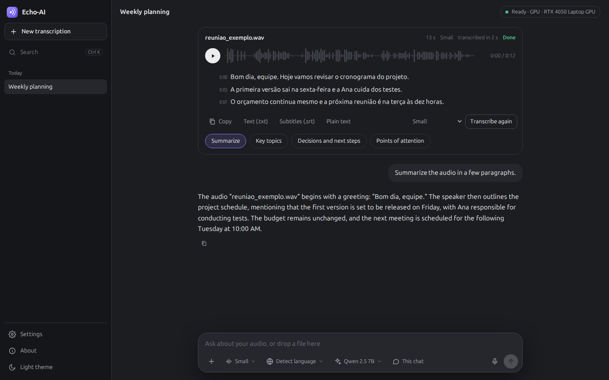

<p align="center"></p>

<h1 align="center">Echo-AI</h1>
<p align="center"><b>Echo AI Audio Transcriber</b><br>Private audio transcription with a local AI assistant. Windows, macOS and Linux, on the GPU or the CPU.</p>
<p align="center"><b>English</b> · <a href="README.pt-BR.md">Português</a> · <a href="README.es.md">Español</a></p>

<p align="center"></p>

Drop any audio or video file, or record with the microphone. Echo-AI transcribes it on your own computer with
[Whisper](https://github.com/openai/whisper), shows the text live, lets you play it back with the transcript
highlighted, and answers questions about what was said with a local AI. Nothing leaves your computer.

## Features

- **Any file with audio.** mp3, m4a, wav, ogg, opus, flac, webm, mp4, mkv, mov, voice notes and more. The format is
  detected from the content, not the file name.
- **Record** straight from the microphone.
- **Live transcript** with timestamps; click a line to hear it. Export as `.txt` or `.srt` subtitles.
- **Ask about the audio:** summaries, key topics, decisions and next steps, points of attention, or any question.
  Answers cite the part of the audio they came from, and you can search your whole history.
- **Models side by side.** Six Whisper models and six local AIs, each with its accuracy (or quality), speed, size and
  a *best for your PC* badge. Pick one, and if it is not installed yet, it downloads right there with a progress bar.
- **Plug and play.** It detects your hardware and picks where to run: an NVIDIA GPU when available, the CPU otherwise.
  No drivers or Python to install by hand; the AI engine installs itself when you first need it.
- **Private by design.** Audio, transcripts and history are stored only on your computer. The internet is used only to
  download a model when you ask. No accounts, no telemetry.
- **English, Portuguese and Spanish** interface, dark and light themes.

## Download

Get the installer for your system from the [latest release](https://github.com/mowbrazilitteam/Echo-AI-Audio-Transcriber/releases/latest).
The Whisper **Small** model comes inside, so your first transcription works offline.

| System | File | First launch |
|---|---|---|
| Windows 10 / 11 (64-bit) | `echo-ai-*-windows.msi` | The installer is not code-signed yet: on the SmartScreen warning, click **More info → Run anyway**. |
| macOS 13+ | `echo-ai-*-mac-arm.dmg` for Apple Silicon (M1 or newer), `echo-ai-*-mac-intel.dmg` for Intel | Drag Echo-AI to Applications. The app is not notarized yet: the first time, right-click it and choose **Open**, or allow it in **System Settings → Privacy & Security**. |
| Ubuntu 24.04+ and derivatives | `echo-ai-*-linux.deb` | `sudo apt install ./echo-ai-*-linux.deb` |
| Any other Linux | — | See [Run from source](#run-from-source): one command with `uv`. |

**Requirements:** 8 GB of RAM (16 GB for the largest AI), about 3 GB of free disk space, and optionally an NVIDIA
graphics card with its driver for much faster transcription. Everything also runs on the CPU, just slower.

## How it works

| Part | What runs | Where |
|---|---|---|
| Transcription | [faster-whisper](https://github.com/SYSTRAN/faster-whisper) (Whisper on CTranslate2) | NVIDIA GPU in float16, or the CPU in int8 |
| AI answers | [Ollama](https://ollama.com) with models of 1 to 8 billion parameters | uses the Ollama already on your computer, or installs a private copy for Echo-AI |
| Memory search | SQLite full-text search plus `nomic-embed-text` vectors | your computer |
| Interface | a local web app in its own window (WebView2, WebKit or Qt WebEngine) | `127.0.0.1` only |

**NVIDIA acceleration.** The installers are kept small, so the CUDA libraries (about 1.4 GB) are not inside. When
Echo-AI finds an NVIDIA card with a working driver, it offers to download the official NVIDIA packages from PyPI,
checks them against the published SHA-256 checksum, and switches transcription to the GPU without a restart. Other
graphics cards and Macs transcribe on the CPU (CTranslate2 accelerates only NVIDIA).

**The AI engine.** If Ollama is not installed, the first time you install an AI Echo-AI downloads the official Ollama
package for your system (a pinned version, checked against Ollama's published SHA-256), unpacks it in its own data
folder and runs it on a private port. No administrator rights are needed.

### Transcription models

| Model | Accuracy | Speed | Download | Best for |
|---|:---:|:---:|---:|---|
| Tiny | ●○○○○ | ●●●●● | 75 MB | tests, very old computers |
| Base | ●●○○○ | ●●●●● | 145 MB | clear speech in a quiet room |
| **Small** (included) | ●●●○○ | ●●●●○ | 480 MB | everyday audio on any computer |
| Medium | ●●●●○ | ●●●○○ | 1.5 GB | more accuracy, a bit slower |
| Large v3 Turbo | ●●●●○ | ●●●●○ | 1.6 GB | near-best accuracy, fast on a GPU |
| Large v3 | ●●●●● | ●●○○○ | 3.1 GB | hard audio: noise, accents, many voices |

### AI models

| Model | Quality | Speed | Download | Best for |
|---|:---:|:---:|---:|---|
| Qwen 2.5 1.5B | ●●○○○ | ●●●●● | 1.0 GB | short summaries on simple computers |
| Llama 3.2 3B | ●●●○○ | ●●●●○ | 2.0 GB | quick answers in English |
| Qwen 2.5 3B | ●●●○○ | ●●●●○ | 1.9 GB | 8 GB of RAM; English, Portuguese, Spanish |
| Gemma 3 4B | ●●●●○ | ●●●○○ | 3.3 GB | natural Portuguese and Spanish |
| Qwen 2.5 7B | ●●●●● | ●●○○○ | 4.7 GB | the best summaries; 16 GB of RAM or a 6 GB GPU |
| Llama 3.1 8B | ●●●●○ | ●●○○○ | 4.9 GB | an 8B alternative, strong in English |

Echo-AI only offers conversational models from 1 to 8 billion parameters: small enough for a normal computer and good
at talking about a transcript. Mixture-of-experts, code and embedding models are left out.

## Your data

Everything is stored in one folder on your computer:

| System | Folder |
|---|---|
| Windows | `%LOCALAPPDATA%\Echo-AI` |
| macOS | `~/Library/Application Support/Echo-AI` |
| Linux | `~/.local/share/echo-ai` |

The folder holds the audio files, the SQLite database with transcripts and chats, the log, and (when installed by
the app) the AI engine and the NVIDIA acceleration package. Whisper models go to the Hugging Face cache
(`~/.cache/huggingface`). Deleting a chat in the app deletes its audio file too.

## Run from source

With [uv](https://docs.astral.sh/uv/) (it installs Python 3.12 for you):

```bash
git clone https://github.com/mowbrazilitteam/Echo-AI-Audio-Transcriber.git
cd Echo-AI-Audio-Transcriber
uv sync                 # add --extra gpu on a computer with an NVIDIA card
uv run echo-ai          # the app, in its own window
```

Or install it as a command on any Linux, macOS or Windows:

```bash
uv tool install git+https://github.com/mowbrazilitteam/Echo-AI-Audio-Transcriber.git
echo-ai
```

`echo-ai --navegador` opens the interface in your default browser instead of a window. `python -m echo_ai.servidor`
runs only the local server. Settings can be changed with environment variables prefixed `ECHO_` (see `.env.example`).

## Development

```bash
uv sync --extra gpu
uv run ruff check . && uv run ruff format --check .
uv run mypy echo_ai tests
uv run pytest
```

Installers are built with [Briefcase](https://briefcase.readthedocs.io) by GitHub Actions for every tag `v*`
(`.github/workflows/instaladores.yml`). To build one locally: `uv run python scripts/incluir_modelo.py small`, then
`uv run briefcase create`, `build` and `package` for your system. The code, comments and variable names are in
Portuguese; the interface is in English, Portuguese and Spanish (`echo_ai/static/i18n.js`).

## Third-party software and models

Echo-AI uses [faster-whisper](https://github.com/SYSTRAN/faster-whisper) and
[CTranslate2](https://github.com/OpenNMT/CTranslate2) (MIT), OpenAI's [Whisper](https://github.com/openai/whisper)
models (MIT), [Ollama](https://github.com/ollama/ollama) (MIT), [PyAV](https://github.com/PyAV-Org/PyAV) and FFmpeg,
[FastAPI](https://fastapi.tiangolo.com), [pywebview](https://pywebview.flowrl.com) and the
[Ubuntu Sans](https://design.ubuntu.com/font) font (Ubuntu Font Licence 1.0, see `echo_ai/static/fontes`). NVIDIA's
CUDA libraries are downloaded from PyPI under NVIDIA's license. **Each AI model has its own license**, shown by Ollama
when it is downloaded: Qwen (Apache 2.0 or the Qwen license), Llama (Llama Community License) and Gemma (Gemma Terms
of Use).

## Credits

Created by **Victor Medeiros**, Mid-level IT Analyst & AI Full-Stack Engineer.

## License

[MIT](LICENSE). You can use, copy, modify and distribute Echo-AI, including commercially, as long as the copyright
notice stays in every copy.
