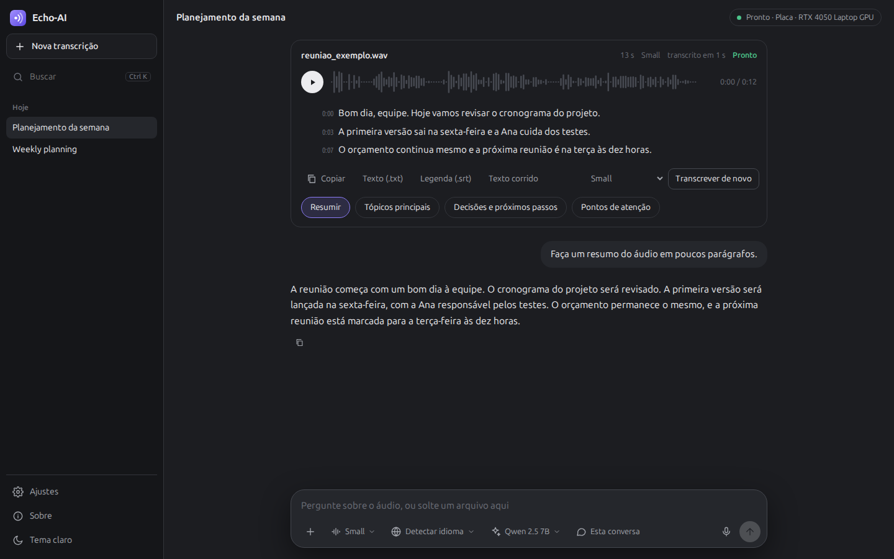

<p align="center"></p>

<h1 align="center">Echo-AI</h1>
<p align="center"><b>Echo AI Audio Transcriber</b><br>Transcrição de áudio privada, com um assistente de IA local. Windows, macOS e Linux, na placa de vídeo ou na CPU.</p>
<p align="center"><a href="README.md">English</a> · <b>Português</b> · <a href="README.es.md">Español</a></p>

<p align="center"></p>

Solte qualquer arquivo de áudio ou vídeo, ou grave pelo microfone. O Echo-AI transcreve no seu próprio computador com
o [Whisper](https://github.com/openai/whisper), mostra o texto ao vivo, toca o áudio com o trecho realçado e responde
perguntas sobre o que foi dito com uma IA local. Nada sai do seu computador.

## O que ele faz

- **Qualquer arquivo com áudio.** mp3, m4a, wav, ogg, opus, flac, webm, mp4, mkv, mov, áudio de WhatsApp e mais. O
  formato é reconhecido pelo conteúdo, não pelo nome do arquivo.
- **Grava** direto do microfone.
- **Transcrição ao vivo** com os tempos; clique numa linha para ouvir. Exporta em `.txt` ou legenda `.srt`.
- **Pergunte sobre o áudio:** resumo, tópicos principais, decisões e próximos passos, pontos de atenção, ou qualquer
  pergunta. A resposta cita o trecho do áudio de onde veio, e dá para buscar em todo o histórico.
- **Modelos lado a lado.** Seis modelos do Whisper e seis IAs locais, cada um com a precisão (ou qualidade), a
  velocidade, o tamanho e o selo *melhor para o seu PC*. Escolha um e, se ainda não estiver instalado, ele baixa ali
  mesmo, com a barra de andamento.
- **Plug and play.** Detecta o hardware e escolhe onde rodar: na placa NVIDIA quando existe, na CPU quando não. Nada de
  driver ou Python para instalar à mão; o motor de IA se instala sozinho na primeira vez que você precisar.
- **Privado desde o desenho.** Áudios, transcrições e histórico ficam só no seu computador. A internet só é usada para
  baixar um modelo quando você pede. Sem conta, sem telemetria.
- **Tela em inglês, português e espanhol**, com tema escuro e claro.

## Baixar

Baixe o instalador do seu sistema na [última versão](https://github.com/mowbrazilitteam/Echo-AI-Audio-Transcriber/releases/latest).
O modelo **Small** do Whisper já vem dentro, então a primeira transcrição funciona sem internet.

| Sistema | Arquivo | Primeira abertura |
|---|---|---|
| Windows 10 / 11 (64 bits) | `echo-ai-*-windows.msi` | O instalador ainda não tem assinatura digital: no aviso do SmartScreen, clique em **Mais informações → Executar assim mesmo**. |
| macOS 13+ | `echo-ai-*-mac-arm.dmg` para Apple Silicon (M1 ou mais novo), `echo-ai-*-mac-intel.dmg` para Intel | Arraste o Echo-AI para Aplicativos. O app ainda não é notarizado: na primeira vez, clique com o botão direito e escolha **Abrir**, ou libere em **Ajustes do Sistema → Privacidade e Segurança**. |
| Ubuntu 24.04+ e derivados | `echo-ai-*-linux.deb` | `sudo apt install ./echo-ai-*-linux.deb` |
| Qualquer outro Linux | — | Veja [Rodar pelo código](#rodar-pelo-código): um comando com o `uv`. |

**Requisitos:** 8 GB de RAM (16 GB para a maior IA), cerca de 3 GB livres no disco e, se quiser, uma placa de vídeo
NVIDIA com o driver instalado, para transcrever bem mais rápido. Tudo roda também na CPU, só que mais devagar.

## Como funciona

| Parte | O que roda | Onde |
|---|---|---|
| Transcrição | [faster-whisper](https://github.com/SYSTRAN/faster-whisper) (Whisper no CTranslate2) | placa NVIDIA em float16, ou CPU em int8 |
| Respostas da IA | [Ollama](https://ollama.com) com modelos de 1 a 8 bilhões de parâmetros | usa o Ollama que já estiver no computador, ou instala uma cópia só do Echo-AI |
| Busca na memória | busca por palavra do SQLite mais os vetores do `nomic-embed-text` | seu computador |
| Tela | um app web local numa janela própria (WebView2, WebKit ou Qt WebEngine) | só em `127.0.0.1` |

**Aceleração NVIDIA.** Os instaladores são leves, então as bibliotecas da CUDA (cerca de 1,4 GB) não vêm dentro.
Quando o Echo-AI encontra uma placa NVIDIA com o driver funcionando, ele oferece baixar os pacotes oficiais da NVIDIA no
PyPI, confere a soma SHA-256 publicada e passa a transcrever na placa sem reiniciar. Outras placas e o Mac transcrevem
na CPU (o CTranslate2 só acelera NVIDIA).

**O motor de IA.** Se o Ollama não estiver instalado, na primeira vez que você instalar uma IA o Echo-AI baixa o
pacote oficial do Ollama para o seu sistema (versão fixa, conferida pela SHA-256 publicada pelo Ollama), extrai na
pasta de dados dele e roda numa porta própria. Não precisa de administrador.

### Modelos de transcrição

| Modelo | Precisão | Velocidade | Download | Para quê |
|---|:---:|:---:|---:|---|
| Tiny | ●○○○○ | ●●●●● | 75 MB | testes, computadores muito antigos |
| Base | ●●○○○ | ●●●●● | 145 MB | fala clara em lugar silencioso |
| **Small** (incluído) | ●●●○○ | ●●●●○ | 480 MB | o áudio do dia a dia em qualquer computador |
| Medium | ●●●●○ | ●●●○○ | 1,5 GB | mais precisão, um pouco mais lento |
| Large v3 Turbo | ●●●●○ | ●●●●○ | 1,6 GB | quase a precisão máxima, rápido na placa |
| Large v3 | ●●●●● | ●●○○○ | 3,1 GB | áudio difícil: barulho, sotaque, muitas vozes |

### Modelos de IA

| Modelo | Qualidade | Velocidade | Download | Para quê |
|---|:---:|:---:|---:|---|
| Qwen 2.5 1.5B | ●●○○○ | ●●●●● | 1,0 GB | resumos curtos em computadores simples |
| Llama 3.2 3B | ●●●○○ | ●●●●○ | 2,0 GB | respostas rápidas em inglês |
| Qwen 2.5 3B | ●●●○○ | ●●●●○ | 1,9 GB | 8 GB de RAM; inglês, português e espanhol |
| Gemma 3 4B | ●●●●○ | ●●●○○ | 3,3 GB | português e espanhol naturais |
| Qwen 2.5 7B | ●●●●● | ●●○○○ | 4,7 GB | os melhores resumos; 16 GB de RAM ou placa de 6 GB |
| Llama 3.1 8B | ●●●●○ | ●●○○○ | 4,9 GB | alternativa de 8 B, forte em inglês |

O Echo-AI só oferece modelos de conversa de 1 a 8 bilhões de parâmetros: pequenos o bastante para um computador comum e
bons em falar de uma transcrição. Modelos de mistura de especialistas, de código e de vetor ficam de fora.

## Seus dados

Tudo fica numa pasta do seu computador:

| Sistema | Pasta |
|---|---|
| Windows | `%LOCALAPPDATA%\Echo-AI` |
| macOS | `~/Library/Application Support/Echo-AI` |
| Linux | `~/.local/share/echo-ai` |

A pasta guarda os áudios, o banco SQLite com as transcrições e as conversas, o log e (quando instalados pelo app) o
motor de IA e o pacote de aceleração da NVIDIA. Os modelos do Whisper ficam no cache do Hugging Face
(`~/.cache/huggingface`). Apagar uma conversa no app apaga o áudio dela também.

## Rodar pelo código

Com o [uv](https://docs.astral.sh/uv/) (ele instala o Python 3.12 para você):

```bash
git clone https://github.com/mowbrazilitteam/Echo-AI-Audio-Transcriber.git
cd Echo-AI-Audio-Transcriber
uv sync                 # acrescente --extra gpu num computador com placa NVIDIA
uv run echo-ai          # o app, na janela própria
```

Ou instale como comando em qualquer Linux, macOS ou Windows:

```bash
uv tool install git+https://github.com/mowbrazilitteam/Echo-AI-Audio-Transcriber.git
echo-ai
```

`echo-ai --navegador` abre a tela no navegador padrão em vez da janela. `python -m echo_ai.servidor` roda só o servidor
local. Os ajustes podem ser trocados por variáveis de ambiente com o prefixo `ECHO_` (veja o `.env.example`).

## Desenvolvimento

```bash
uv sync --extra gpu
uv run ruff check . && uv run ruff format --check .
uv run mypy echo_ai tests
uv run pytest
```

Os instaladores são gerados pelo [Briefcase](https://briefcase.readthedocs.io) no GitHub Actions a cada tag `v*`
(`.github/workflows/instaladores.yml`). Para gerar um localmente: `uv run python scripts/incluir_modelo.py small` e
depois `uv run briefcase create`, `build` e `package` para o seu sistema. O código, os comentários e os nomes estão em
português; a tela está em inglês, português e espanhol (`echo_ai/static/i18n.js`).

## Software e modelos de terceiros

O Echo-AI usa o [faster-whisper](https://github.com/SYSTRAN/faster-whisper) e o
[CTranslate2](https://github.com/OpenNMT/CTranslate2) (MIT), os modelos [Whisper](https://github.com/openai/whisper) da
OpenAI (MIT), o [Ollama](https://github.com/ollama/ollama) (MIT), o [PyAV](https://github.com/PyAV-Org/PyAV) e o FFmpeg,
o [FastAPI](https://fastapi.tiangolo.com), o [pywebview](https://pywebview.flowrl.com) e a fonte
[Ubuntu Sans](https://design.ubuntu.com/font) (Ubuntu Font Licence 1.0, veja `echo_ai/static/fontes`). As bibliotecas
CUDA da NVIDIA são baixadas do PyPI sob a licença da NVIDIA. **Cada modelo de IA tem a sua própria licença**, mostrada
pelo Ollama no download: Qwen (Apache 2.0 ou a licença Qwen), Llama (Llama Community License) e Gemma (Gemma Terms of
Use).

## Créditos

Criado por **Victor Medeiros**, Mid-level IT Analyst & AI Full-Stack Engineer.

## Licença

[MIT](LICENSE). Você pode usar, copiar, modificar e distribuir o Echo-AI, inclusive comercialmente, desde que o aviso de
copyright fique em todas as cópias.
